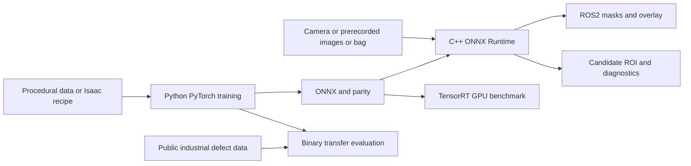

# AeroSurface-RT

**Sim-to-Real Robotic Surface Perception & Edge Inference**

A compact robotics perception project that segments industrial panel images into sandable surface,
protected regions, defects, obstacles and unknown background. It carries a trained model through
ONNX, TensorRT GPU inference and a modern C++ ROS2 runtime, with measured performance and visible
failure cases.

**This is an independent portfolio project inspired by industrial robotic surface-preparation
problems and is not affiliated with or endorsed by any employer.** No proprietary code,
data, designs or hardware access are implied.

Surface preparation needs pixel boundaries: a small seam or protected fixture matters even when
the surrounding panel is easy to detect. This project explores that perception layer. It does not
control a robot or certify that a predicted region is safe to sand.


Each row shows an actual generated input, ground truth, ONNX Runtime overlay and candidate ROI.
The images are **procedural 2-D synthetic data, not Isaac Sim renderings**. Rows include low light,
overexposure, texture, angle, blur, noise, small defects and occlusion.

## What works

- Deterministic RGB/semantic/depth-proxy generation, train/validation/test splits and metadata.
- Two lightweight PyTorch U-Nets trained on CUDA, evaluated on held-out stress conditions.
- Static batch-one ONNX export and numerical validation against PyTorch.
- Actual TensorRT FP32 and FP16 engine builds, inference, parity and latency measurements.
- C++17 ORT runtime with RAII, validated model/image contracts, masks, overlays and eroded ROIs.
- ROS2 Jazzy C++ node, hardware-free image publisher, launch graph and diagnostics/watchdog.
- Real KolektorSDD2 binary transfer experiment with the official 1,004-image test split.
- Python/native tests, CMake, reproducible CLIs and machine-readable benchmark reports.

Isaac Sim/Replicator scene generation is implemented and syntax-tested, but **not executed** because
Isaac Sim is absent. Docker recipes are provided but **not built**. INT8, NITROS and a C++ TensorRT
ROS backend are not implemented. See [validation status](docs/validation.md) for precise execution
boundaries rather than treating every source file as a validated feature.

## Architecture



The deployed model accepts float32 RGB `[1,3,128,160]` scaled by 1/255 and emits logits
`[1,5,128,160]`. IDs: **0 unknown, 1 sandable, 2 protected, 3 defect, 4 obstacle**. Candidate ROI
requires confidence ≥0.65 and a three-pixel erosion margin. All other pixels are avoided.
[Architecture and ROS contracts](docs/architecture.md) explain QoS, image coordinates, frame IDs,
failure handling and why these image-space regions are not robot safety guarantees.

## Installation and quick start

Use Python **3.10**. From the repository root, in PowerShell:

```powershell
python -m venv .venv
.\.venv\Scripts\python.exe -m pip install torch==2.5.1 --index-url https://download.pytorch.org/whl/cu118
.\.venv\Scripts\python.exe -m pip install -e ".[dev]"
.\.venv\Scripts\python.exe -m aerosurface.cli smoke
```

CPU-only machines may use the PyTorch CPU wheel index. GPU training is optional; TensorRT needs
an appropriate NVIDIA GPU, driver and compatible TensorRT installation. The measured environment
is in [environment.md](docs/environment.md); TensorRT and training use distinct CUDA runtimes.

```powershell
# Full procedural training/evaluation/export/headless demo and CPU/CUDA benchmarks:
powershell -ExecutionPolicy Bypass -File scripts/reproduce.ps1
# With locally installed TensorRT and Visual Studio C++ build tools:
powershell -ExecutionPolicy Bypass -File scripts/reproduce.ps1 -TensorRT -Native
```

If artifacts already exist, reproduce just the visible demo:

```powershell
.\.venv\Scripts\python.exe -m aerosurface.cli demo
```

Outputs: `artifacts/demo/contact_sheet.png`, `overlay.png`, `mask.png`, `sandable.png`, `avoid.png`,
`defect.png`, `protected.png`, and native PPM input. No physical camera or graphical desktop is needed.

## Individual experiments

```bash
python -m aerosurface.cli data
python -m aerosurface.cli train
python -m aerosurface.cli evaluate
python -m aerosurface.cli export
python -m aerosurface.cli parity
python -m aerosurface.cli demo
python -m aerosurface.cli benchmark --iterations 200 --warmup 30
python -m pytest -q
```

Use the virtualenv's `python` or activate it first. `make setup`, `smoke`, `data`, `train`,
`evaluate`, `export`, `demo`, `test`, `benchmark`, `tensorrt`, `cpp`, `real`, and `lint` provide
equivalent Linux interfaces. `make tensorrt` requires TensorRT/CUDA; `make cpp` requires CMake and
the ORT SDK. Ordinary ML targets do not require ROS or Isaac.

For the larger model, pass `--config configs/baseline.json --run models/baseline` to training.
Pass `--run models/baseline --output benchmarks/baseline` to benchmarking so its results do not
overwrite the edge model's measurements. Checkpoint configuration determines export dimensions.

## Native C++ deployment

```powershell
.\.venv\Scripts\python.exe scripts/fetch_ort.py
cmake -S . -B build -A x64 "-DONNXRUNTIME_ROOT=$PWD/third_party/onnxruntime-win-x64-1.19.2"
cmake --build build --config Release
ctest --test-dir build -C Release --output-on-failure
.\build\cpp\Release\aerosurface_infer.exe models/edge/model.onnx artifacts/demo/input.ppm artifacts/demo/cpp 160 128
.\.venv\Scripts\python.exe scripts/check_cpp_parity.py
```

## TensorRT optimization

```bash
python -m aerosurface.cli tensorrt
python -m aerosurface.cli benchmark --iterations 200 --warmup 30
```

TensorRT 11 strongly typed engines are built from explicit FP32/FP16 ONNX tensors. FP32 TF32 math
is disabled. Parity is checked before timing; engine build/loading and warmup are excluded.
No INT8 claim is made. Engines are hardware/runtime-specific; rebuild locally. See
[runtime compatibility and CLI alternatives](docs/reproducibility.md).

## ROS2 demo

ROS2 Jazzy runs under Ubuntu 24.04, including the existing WSL installation used here. From a
sourced ROS shell after following the [ROS build instructions](docs/reproducibility.md):

```bash
source /opt/ros/jazzy/setup.bash
source artifacts/ros_install/setup.bash
export LD_LIBRARY_PATH="$PWD/third_party/onnxruntime-linux-x64-1.19.2/lib:${LD_LIBRARY_PATH:-}"
ros2 launch aerosurface_perception demo.launch.py \
  model:="$PWD/models/edge/model.onnx" images:="$PWD/data/procedural"
```

Inspect `/aerosurface/overlay`, `/aerosurface/mask`, `/aerosurface/sandable`, `/aerosurface/avoid`,
`/aerosurface/defect`, `/aerosurface/protected` and `/diagnostics`. The C++ ROS backend is ORT CPU;
GPU TensorRT performance belongs to the separate native TensorRT Python experiment.
`python3 scripts/ros_integration.py` exercises message contracts, fail-closed behavior and rosbag replay.

## Actual results

Measured on a shared RTX 4060 Laptop GPU / Ryzen 9 8945HS machine, at 160×128 and batch one.
These are host-input-to-host-logits timings, **not full ROS or robot-loop FPS**.

| Runtime | p50 ms | p95 ms | Test mIoU |
|---|---:|---:|---:|
| PyTorch CUDA FP32 | 1.413 | 2.270 | 0.7561 |
| ONNX Runtime CPU FP32 | 9.510 | 12.895 | 0.7561 |
| TensorRT FP32 | 0.560 | 1.067 | 0.7561 |
| TensorRT FP16 | 0.581 | 1.157 | 0.7562 |

The 66,725-parameter edge model reached 0.9304 nominal validation mIoU and 0.7561 on the 64-image
stress test. The 265,637-parameter baseline scored 0.5867 on the same stress test. Higher capacity
did not help this short experiment. FP16 was not meaningfully faster than TensorRT FP32 here;
host/runtime overhead and the tiny graph limit that comparison.

[Benchmark report](docs/benchmark_report.md) includes raw-error parity, timing boundaries, model
sizes, baseline results and caveats. Raw samples are in `benchmarks/results.json` and CSV. The
standalone C++ test has a different timing scope and is reported separately.

The actual ROS2 Jazzy launch produced 20 overlay frames. A separate 100-call WSL ROS benchmark
measured 7.976 ms median and 8.934 ms p95 from publishing RGB to receiving all six output images.
Live failure handling and six storage-backed replay frames passed regression checks.

## Synthetic-to-real experiment

```bash
python scripts/download_ksdd2.py --accept-noncommercial-license
python -m training.real_domain --epochs 6
```

The original [KolektorSDD2](https://www.vicos.si/resources/kolektorsdd2/) is CC BY-NC-SA 4.0;
no real images or adapted weights are redistributed. Its labels support **binary defect** comparison
only. Synthetic-only defect IoU was 0.0112; synthetic pretraining followed by short real fine-tuning
reached 0.2729. The equally short scratch baseline predicted no defects. This single-seed study uses
a small training subset, not a competitive full-data benchmark. See [data mapping](docs/datasets.md)
and the [executed transfer report](docs/sim_to_real.md).

## Failure cases and limitations

Low-light test mIoU fell to 0.4508. Thin seams, unusual textures and tiny defects remain difficult.
Despite filtering/erosion, 0.237% of candidate pixels had non-sandable ground-truth labels. The
candidate output must not authorize a real sanding operation. [Failure analysis](docs/failure_analysis.md)
shows actual errors and distinguishes tested fixes from proposed mitigations.

The model was trained from scratch on a small procedural toy domain. There is no aircraft data,
physical robot test, calibrated depth use, tool footprint projection, pose estimation, collision
avoidance, temporal fusion or hard real-time guarantee. Isaac generation and Docker execution
remain unvalidated. No proprietary industrial-system performance is claimed.

## Repository map

| Path | Purpose |
|---|---|
| `aerosurface/` | model, tensor contracts, metrics, runtime, CLI and benchmark |
| `training/` | deterministic synthetic training and binary real-domain experiment |
| `simulation/` | runnable procedural fallback, Isaac recipe and ID adapter |
| `cpp/` | C++17 core, ORT inference executable and tests |
| `ros2_ws/src/aerosurface_perception/` | ROS node, demo publisher and launch |
| `configs/` | edge/baseline/Isaac experiment configuration |
| `scripts/` | reproducibility, SDK/data preparation, integration and reports |
| `tests/` | Python, ONNX and native integration tests |
| `benchmarks/` | actual metrics, raw latencies and validation records |
| `docs/` | architecture, provenance, performance and failure analysis |
| `docker/` | separate CPU ML and ROS build recipes |
| `assets/` | small actual procedural demo image |

Datasets, models, engines, SDKs and build products are ignored and generated locally. Code is MIT;
third-party datasets and libraries retain their own licenses.

Highest-value next work: validate Isaac generation, collect compatible realistic pixel labels,
train a stronger real-domain baseline with native-resolution crops, calibrate confidence, add
geometric exclusion checks, and port the measured TensorRT backend into the C++ ROS node.
