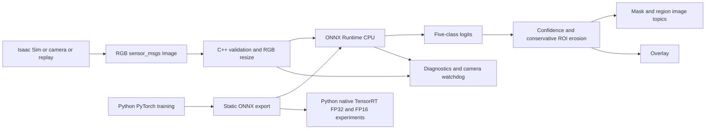
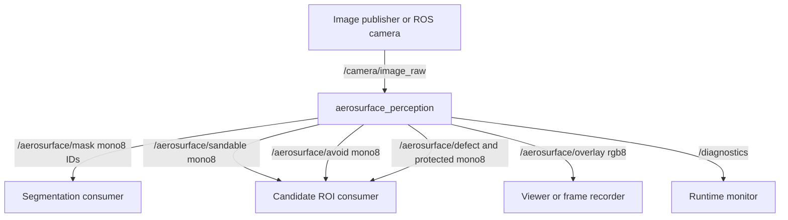

# Architecture

AeroSurface-RT explores pixel-level workspace understanding for robotic preparation of curved
industrial surfaces. It outputs candidate image regions for downstream planning, not trajectories,
contact forces or certified safety decisions.

## Contracts

| ID | Meaning | Color |
|---|---|---|
| 0 | background_or_unknown, including low confidence | dark blue |
| 1 | sandable_surface | green |
| 2 | protected_or_avoid_region, including seams | yellow |
| 3 | surface_defect | red |
| 4 | obstacle | purple |

RGB uint8 HWC is resized with floor-nearest sampling, converted to float32 /255 and laid out as
`[1,3,128,160]`. No BGR ambiguity, mean subtraction, dynamic batch or hidden model-specific
normalization is used. The same formula is tested in Python and C++. Output is **logits**
`[1,5,128,160]`, never probabilities; softmax is applied during postprocessing. The graph is static
for deployment. U-Net training remains spatially convolutional; the binary real-domain experiment
uses `[N,3,320,128]` to approximately preserve the public dataset's tall aspect ratio.

The model is a two-level U-Net with ordinary convolution/ReLU/max-pool/nearest resize/concatenation.
The edge width is 12 channels; a 24-channel baseline tests whether capacity helps. This choice gives
a small, auditable graph with no downloaded pretrained weights, unsupported custom operators or
large backbone dependencies. It sacrifices semantic richness and realistic feature priors.

## ROS graph and ownership

The C++ node owns its runtime via `unique_ptr`; ORT environment/session/options and temporary
tensors use RAII. A single-threaded ROS executor serializes access to the ORT session and watchdog.
Input buffers are validated for dimensions, encoding and padded row stride. `rgb8` and `bgr8` are
supported. The node copies ROS input into a contiguous RGB buffer; this is a deliberately visible
cost. NITROS, loaned GPU messages and zero-copy are not implemented.

Camera data and output images use best-effort, volatile, keep-last-one SensorDataQoS. Dropping an
old camera frame is preferable to queuing stale work. A single callback cannot preempt inference;
downstream applications must enforce their own deadline and freshness policy. Diagnostics use
reliable depth 10. Parameters are read at startup; restart for model/backend/resolution changes.

`model_path`, `backend`, `precision`, `input_width`, `input_height`, `threads`,
`confidence_threshold`, `erosion_margin`, `image_topic`, `output_prefix`, `visualization`,
`benchmark_mode`, and `max_image_age_seconds` are exposed. Unsupported backends and model
contracts fail startup explicitly. The validated C++ backend is ORT CPU FP32. Native TensorRT GPU
inference is a separate measured Python deployment experiment, not a hidden C++/ROS backend.

## Frames, depth and safety boundaries

Output masks and overlays have model resolution and preserve the original timestamp/frame ID.
Their pixels are resized image coordinates, not original camera pixels. Do not use original
CameraInfo intrinsics directly with them: scale intrinsics or resample masks to camera resolution.
No TF, deprojection, surface normals, robot calibration or 3-D collision checks are implemented.
Camera optical frame convention is x right, y down, z forward; no world-frame pose is published.

Procedural data contains analytic depth proxies; Isaac's recipe requests distance to image plane.
Depth is auxiliary data only and is not consumed by the trained model or ROS node. Supporting RGB
first avoids implying geometric safety from uncalibrated synthetic depth.

Pixels below confidence 0.65 become unknown. The candidate mask contains only class 1 and is eroded
by a square radius of three model pixels, with zero padding at image boundaries. Defects are excluded
until a downstream process explicitly determines how to treat them. `avoid` is the complement of
the eroded candidate ROI, including unknowns; it is broader than the protected-class mask.

Bad frames, stale timestamps, nonfinite logits and inference exceptions produce unknown masks,
empty candidate ROI, all-avoid and ERROR diagnostics. A 100 ms watchdog clears candidates after
the configured camera timeout. Startup model errors terminate with a visible error. Consumers must
also handle node death, lost messages, calibration failures and stale data independently. Confidence
is not calibrated and confident mistakes remain; measured false-candidate pixels are reported.

## Experimental boundaries

Training uses deterministic seeds, disjoint procedural scene seeds, weighted cross-entropy,
horizontal flips, mixed precision on CUDA and best validation mIoU. Validation is nominal; the
test contains nine labelled stress conditions. All metrics aggregate confusion counts across
pixels; absent-class ratios are null rather than fabricated perfect values.

TensorRT 11 uses strongly typed ONNX. FP16 is exported explicitly from the half-precision model;
FP32 disables TF32 for a true precision comparison. CUDA buffers, stream, engine and context are
owned for the entire inference session; copies are synchronized before host output is read.
Serialized engines are GPU/runtime-specific and are never committed.

Benchmarking separates warmup/build/startup, host-to-host inference, C++ preprocessing/inference/
postprocessing and ROS integration observations. See the measured report for exact boundaries.
Sim-to-real compares binary defect probabilities only; public industrial data cannot supervise
aircraft sandability or protected fixtures. The current simulator fallback is a colored 2-D
procedural toy domain, so transfer conclusions remain exploratory.
