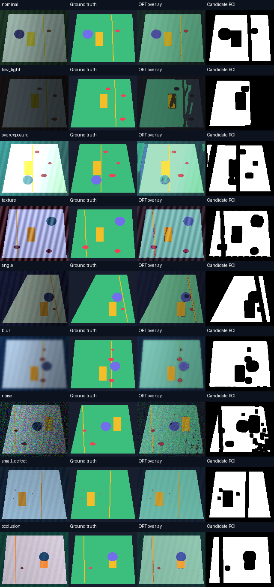

# Failure analysis

These failures come from executed held-out evaluation. Representative input/truth/overlay/candidate frames are shown below.

| Test condition | mIoU | Defect recall |
|---|---:|---:|
| nominal | 0.9487 | 0.9550 |
| low_light | 0.4508 | 0.3094 |
| overexposure | 0.7984 | 0.7933 |
| texture | 0.7059 | 0.8808 |
| angle | 0.8707 | 0.9206 |
| blur | 0.8173 | 0.6591 |
| noise | 0.8323 | 0.9693 |
| small_defect | 0.8009 | 0.1154 |
| occlusion | 0.9042 | 0.9571 |

## Observed cases

| Input / observed error | Probable cause | Severity | Mitigation / tested? |
|---|---|---|---|
| Low light: protected fixture becomes fragmented, obstacles/defects confused; lowest slice mIoU | Color shortcuts and limited training exposure range | High: may admit prohibited pixels | Exposure augmentation, photometric checks and real data; not tested as a five-class mitigation |
| Strong stripe texture: defect/protected confusion | Synthetic texture competes with color cues | High | Texture diversity and real material priors; not tested |
| Blur: thin seam erodes/disappears and small defects lose boundaries | 160×128 sampling and local evidence loss | High | Higher resolution, boundary supervision and multi-frame confirmation; not tested |
| Small defects: missing/expanded few-pixel regions | Very few supervised pixels and imbalance | Medium/high | Native-resolution crops and recall-focused sampling; not tested |
| Real-only six-epoch baseline predicts no defects | Sparse positives, short training and random initialization | High | Longer training, defect-balanced crops and pretrained features; not tested |
| Synthetic-only real images: almost all defects missed | Severe material/geometry/color domain gap | High | Real fine-tuning was tested; see transfer report |

Default candidate ROI still contains **1,563 non-sandable-labelled pixels** out of 658,912 candidates (0.237%). Coverage of true sandable pixels is 72.81%. Confidence and erosion do not certify safety. They exclude uncertain pixels and margins, but confident misclassification remains. Do not use this project to authorize sanding without independent geometric and process constraints.

## Execution failures that were fixed

- Strict deterministic training rejected CUDA 2-D NLL reduction. Flattening logits/targets used a supported deterministic reduction and the smoke run passed.
- Trained ONNX parity exposed small near-zero FP32 cancellation differences. A documented mixed absolute/relative tolerance was used; argmax equality was independently checked.
- Initial GPU/TensorRT FP32 validation caught default TF32 math. TF32 was disabled and engines rebuilt; true FP32 parity passed without relaxing its relative error gate.
- Official KSDD2 contained unlabelled duplicate files. Only byte-identical duplicate copies were excluded; unexpected missing masks still fail loudly.
- Native MSVC initially could not access its SDK under the sandbox. A permitted build with SDK access compiled the same code and passed CTest.
